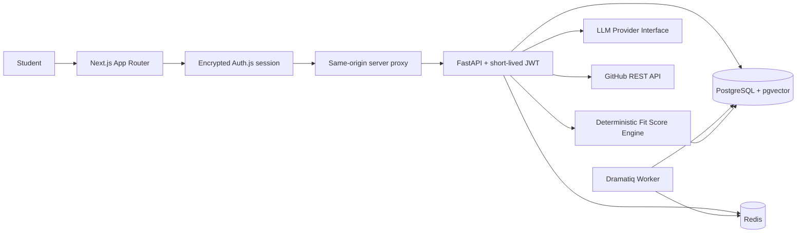
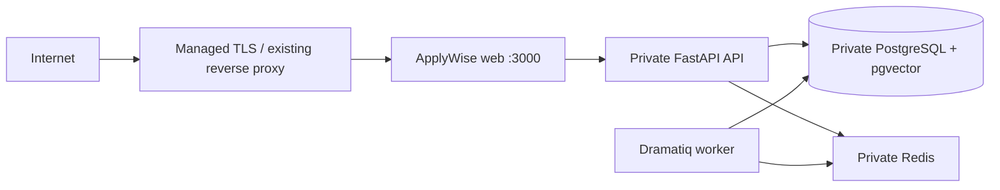

# ApplyWise

ApplyWise is an AI-powered internship intelligence platform for computer engineering and data/AI students. It helps students move through the full internship workflow: find roles, analyze fit, improve their profile, track applications, prepare interviews, and learn missing skills.

This MVP is wired for a local demo without external accounts: deterministic local analyzers stand in for LLM calls, seeded data creates a demo student, and the full workflow is available through Docker Compose. The repository also includes a production Compose topology with private data services, automatic migrations, runtime environment validation, and health endpoints.

## Architecture

The monorepo is split into a Next.js frontend, a FastAPI backend, a Dramatiq worker, PostgreSQL with pgvector, and Redis. The frontend never calls AI providers directly; all backend and AI workflows are routed through the API service. Scoring is hybrid: Python computes component scores and totals, while the AI provider interface supplies structured qualitative feedback.

GitHub Actions runs the API tests and lint checks, frontend type/lint/build checks, production dependency audit, Compose validation, and both production image builds on every pull request and push to `main`. Dependabot checks the npm, Python, Docker, and Actions dependency surfaces weekly.



## Repository Layout

- `web/`: Next.js App Router frontend with TypeScript, Tailwind CSS, and shadcn/ui config.
- `api/`: FastAPI backend using a `src` layout with pytest and ruff.
- `docker-compose.yml`: production Docker Compose base topology.
- `docker-compose.dev.yml`: local development override with hot reload and published data-service ports.
- `infra/`: infrastructure notes and the original compose/env samples.
- `Makefile`: common development, test, migration, and seed commands.

## Local Development

Start the local stack with the development override:

```bash
make dev
```

In another terminal, load the demo dataset:

```bash
make seed
```

Open the frontend at [http://localhost:3000](http://localhost:3000). The development API is available at [http://localhost:8000](http://localhost:8000).

The local stack uses the same-origin `/api/backend` proxy for browser requests, so client workflows do not need to reach the FastAPI port directly.

## Production Deployment

The root [docker-compose.yml](docker-compose.yml) is the production topology. It exposes only the Next.js web service; API, Redis, and PostgreSQL remain on a private Docker network. The browser never receives the backend bearer token: the web service validates the encrypted Auth.js session and injects a short-lived credential while proxying requests internally.



1. Point your deployment platform or reverse proxy at port `3000` and terminate TLS there. The production app requires an HTTPS `NEXTAUTH_URL`.
2. Create the untracked production environment file:

```bash
cp .env.production.example .env.production
```

3. Generate distinct secrets and place them in `.env.production`:

```bash
openssl rand -base64 48
openssl rand -base64 48
```

4. Set every placeholder in `.env.production`, including the public URLs, independent secrets, PostgreSQL credentials, GitHub OAuth credentials, monitored `SUPPORT_EMAIL`, and the OpenAI-compatible LLM endpoint, key, and model. Use URL-safe PostgreSQL credentials, and keep the password in `DATABASE_URL` aligned with `POSTGRES_PASSWORD`.
5. In the GitHub OAuth application, set the authorization callback URL to `https://your-domain.example/api/auth/callback/github`. Its homepage URL should match `NEXTAUTH_URL`.
6. Review the public [privacy notice](web/src/app/privacy/page.tsx) and [terms of use](web/src/app/terms/page.tsx) for your legal entity, jurisdiction, backup-retention policy, and provider contracts.
7. Run the release gate and start the production stack:

```bash
make deploy
```

`make deploy` runs the backend/frontend tests, lint checks, production image builds, Compose validation, and runtime environment validation before starting containers. The `migrate` service then upgrades Alembic migrations before the API and worker start.

Production startup rejects development secrets, default database credentials, wildcard hosts, non-HTTPS origins, placeholder support details, invalid request limits, incomplete GitHub OAuth, and missing external LLM configuration. The unrestricted local email provider is disabled in production. Any GitHub user can self-provision without an allowlist; supporting users without GitHub requires a real transactional email provider.

Verify the public web health endpoint after the platform or proxy is routing traffic:

```bash
curl https://your-domain.example/api/health
```

Expected response:

```json
{"status":"ok"}
```

When using a host reverse proxy, forward the original host and HTTPS scheme to port `3000`. For example, the upstream needs the equivalent of `Host`, `X-Forwarded-Host`, and `X-Forwarded-Proto: https` headers. Keep port `3000` private to that proxy where possible; PostgreSQL, Redis, and FastAPI are already private to the Compose network.

Production status, logs, backup, and shutdown commands:

```bash
make deploy-status
make deploy-logs
make backup
make deploy-down
```

Store backups in encrypted off-host storage and test restoration before launch. Do not run `make seed` against a production database.

## Free Public Beta

The repository also includes [render.yaml](render.yaml) and [Dockerfile.render-free](Dockerfile.render-free) for a zero-cost public beta. This target runs Next.js and FastAPI in one Render Free web service, keeps FastAPI on the container loopback interface, uses a Render Free Key Value instance for quotas, and expects a Neon PostgreSQL connection string in `DATABASE_URL`. Neon-style `postgresql://` URLs are normalized to the configured psycopg driver automatically.

The free target intentionally omits the placeholder worker and uses the local qualitative-analysis provider, so it does not require a paid LLM API. It is a beta topology, not the production topology: Render can sleep the service after inactivity, free Key Value data is not durable, and free database/service quotas apply. The regular Docker Compose production deployment remains unchanged.

## Public Launch Checklist

- DNS points to the selected host and HTTPS is active before OAuth is enabled.
- GitHub OAuth homepage and callback URLs match the production origin exactly.
- The support inbox is monitored, and the privacy notice and terms have owner/legal approval.
- The external LLM provider has billing limits, data-retention settings, and an API key restricted to this service.
- `AI_ACTIONS_PER_HOUR` matches the launch budget; Redis-backed quotas fail closed if usage controls are unavailable.
- `/api/health` is monitored externally, and container logs are shipped or retained by the hosting platform.
- `make backup` is scheduled and encrypted copies are stored off-host.
- A rollback keeps the previous image or commit available, with a database backup taken before migrations.

## Demo Login

Use the local email provider with:

```text
demo@applywise.dev
```

The seed command creates that user, a profile, a parsed resume, three GitHub repository analyses, three job posts, fit analyses, roadmaps, interview prep records, and tracked applications.

## Common Commands

```bash
make dev      # local development stack with hot reload
make test
make lint
make migrate
make seed
make deploy-check
make release-check
make deploy   # production stack using .env.production
```

## Environment Variables

Use [web/.env.example](web/.env.example) and [api/.env.example](api/.env.example) for local process development. Use [.env.production.example](.env.production.example) as the production deployment template.

- `api/.env.example`: FastAPI runtime, PostgreSQL, Redis, backend JWT validation, quotas, request limits, and LLM provider settings.
- `web/.env.example`: same-origin browser API proxy, server-side API URL, Auth.js secrets, backend JWT signing values, and optional GitHub OAuth credentials.
- `.env.production`: untracked production credentials and public-domain configuration.

Keep `AUTH_JWT_SECRET`, `AUTH_JWT_AUDIENCE`, and `AUTH_JWT_ISSUER` aligned between the frontend and backend.

For a timestamped backup before a host migration or upgrade:

```bash
make backup
```

## Verification

After `make dev`, verify both the internal API and the web health endpoint:

```bash
curl http://localhost:8000/health
curl http://localhost:8000/ready
curl http://localhost:3000/api/health
```

Expected response:

```json
{"status":"ok"}
```

When `make seed` finishes, the expected tail output is:

```text
Seeded demo user demo@applywise.dev with 3 applications.
```

## Screenshots

Capture these views for product demos after the stack is running:

- Dashboard: active applications, deadlines, average fit score, missing skills, and next actions.
- Profile Builder: education, tagged skills, projects, roles, languages, and preferences.
- Job Analysis: structured job extraction, deterministic fit score, roadmap, and save-to-tracker action.
- Application Detail: status, notes, interview prep, and exportable report.
