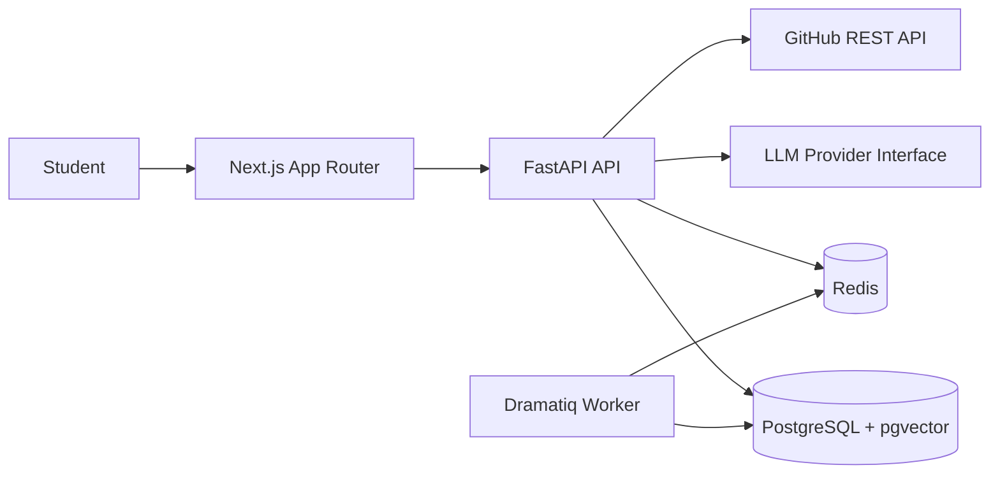

# ApplyWise

ApplyWise is an AI-powered internship intelligence platform for computer engineering and data/AI students. It helps students move through the full internship workflow: find roles, analyze fit, improve their profile, track applications, prepare interviews, and learn missing skills.

## Architecture

The monorepo is split into a Next.js frontend, a FastAPI backend, and Docker Compose infrastructure. The frontend never calls AI providers directly; all backend and AI workflows are routed through the API service.



## Repository Layout

- `web/`: Next.js App Router frontend with TypeScript, Tailwind CSS, and shadcn/ui config.
- `api/`: FastAPI backend using a `src` layout with pytest and ruff.
- `infra/`: Docker Compose configuration for local development.

## Local Development

Copy environment files if you want editable local values:

```bash
cp web/.env.example web/.env
cp api/.env.example api/.env
```

Boot the full stack:

```bash
make dev
```

Run tests and linting:

```bash
make test
make lint
```

Run placeholders for future database workflows:

```bash
make migrate
make seed
```

## Demo Verification

After `make dev`, verify the API health endpoint:

```bash
curl http://localhost:8000/health
```

Expected response:

```json
{"status":"ok"}
```

Open the frontend at [http://localhost:3000](http://localhost:3000). The home page shows the backend health status fetched from the API service.
