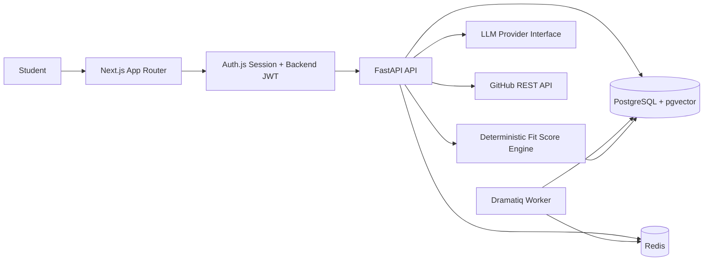

# ApplyWise

ApplyWise is an AI-powered internship intelligence platform for computer engineering and data/AI students. It helps students move through the full internship workflow: find roles, analyze fit, improve their profile, track applications, prepare interviews, and learn missing skills.

This MVP is wired for a local demo without external accounts: deterministic local analyzers stand in for LLM calls, seeded data creates a demo student, and the full workflow is available through Docker Compose.

## Architecture

The monorepo is split into a Next.js frontend, a FastAPI backend, a Dramatiq worker, PostgreSQL with pgvector, and Redis. The frontend never calls AI providers directly; all backend and AI workflows are routed through the API service. Scoring is hybrid: Python computes component scores and totals, while the AI provider interface supplies structured qualitative feedback.



## Repository Layout

- `web/`: Next.js App Router frontend with TypeScript, Tailwind CSS, and shadcn/ui config.
- `api/`: FastAPI backend using a `src` layout with pytest and ruff.
- `docker-compose.yml`: one-command local stack for the full product.
- `infra/`: infrastructure notes and the original compose/env samples.
- `Makefile`: common development, test, migration, and seed commands.

## Setup

Copy environment files if you want editable local values:

```bash
cp web/.env.example web/.env
cp api/.env.example api/.env
```

Boot the full stack from the repository root:

```bash
docker compose up --build
```

In another terminal, run migrations and load a complete demo dataset:

```bash
make seed
```

Open the frontend at [http://localhost:3000](http://localhost:3000). The API is available at [http://localhost:8000](http://localhost:8000).

## Demo Login

Use the local email provider with:

```text
demo@applywise.dev
```

The seed command creates that user, a profile, a parsed resume, three GitHub repository analyses, three job posts, fit analyses, roadmaps, interview prep records, and tracked applications.

## Common Commands

```bash
make dev      # docker compose up --build
make test
make lint
make migrate
make seed
```

## Environment Variables

The root Compose file injects container-safe defaults. For local process development, copy the examples above and edit:

- `api/.env.example`: FastAPI runtime, PostgreSQL, Redis, backend JWT validation, and optional LLM provider settings.
- `web/.env.example`: browser/server API URLs, Auth.js secrets, backend JWT signing values, and optional GitHub OAuth credentials.

Keep `AUTH_JWT_SECRET`, `AUTH_JWT_AUDIENCE`, and `AUTH_JWT_ISSUER` aligned between the frontend and backend.

## Verification

After `docker compose up --build`, verify the API health endpoint:

```bash
curl http://localhost:8000/health
```

Expected response:

```json
{"status":"ok"}
```

When `make seed` finishes, the expected tail output is:

```text
Seeded demo user demo@applywise.dev with 3 applications.
```

## Screenshots

Capture these views for product demos after the stack is running:

- Dashboard: active applications, deadlines, average fit score, missing skills, and next actions.
- Profile Builder: education, tagged skills, projects, roles, languages, and preferences.
- Job Analysis: structured job extraction, deterministic fit score, roadmap, and save-to-tracker action.
- Application Detail: status, notes, interview prep, and exportable report.
